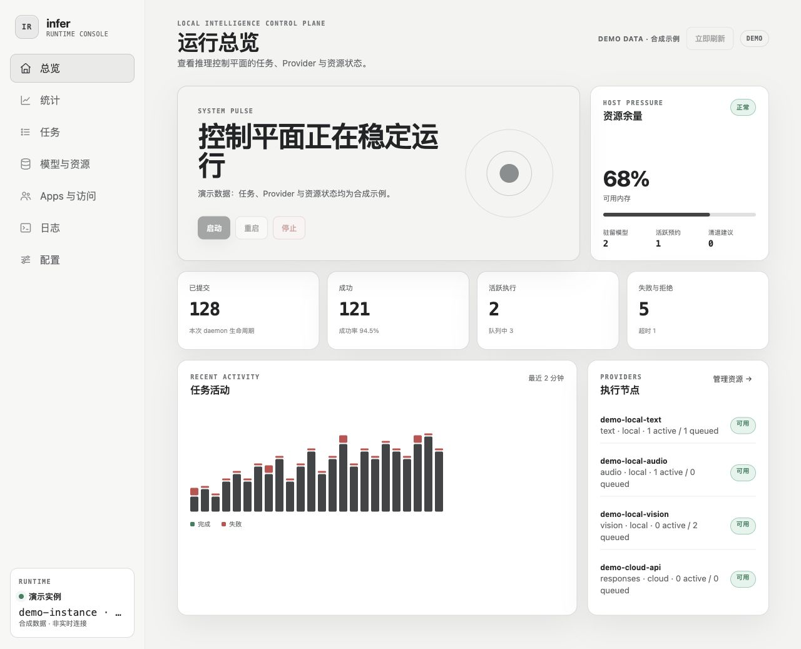
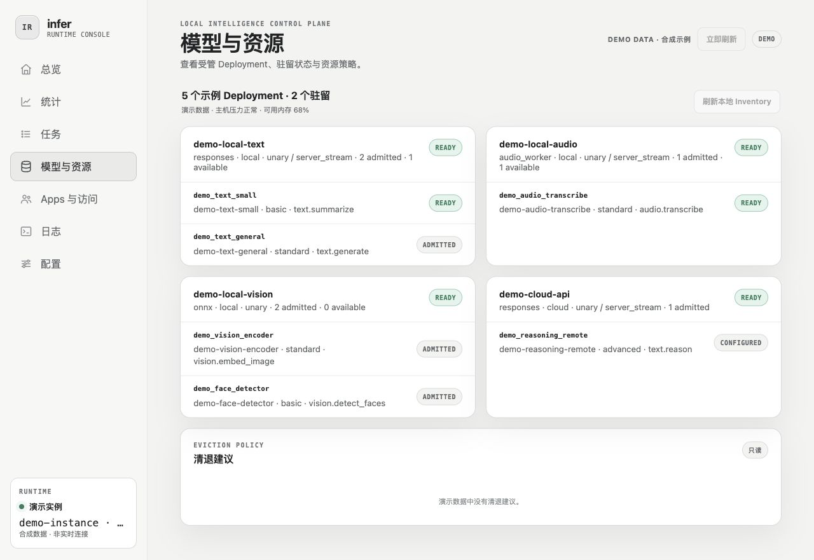

# infer-runtime

> A local-first AI inference control plane for heterogeneous intelligence resources.

`infer-runtime` 让应用只表达 Intent、能力下限、推理投入、延迟、位置、隐私和回退约束，由 Runtime 负责选择
Provider 与 Deployment，并统一处理排队、配额、模型驻留、取消、故障切换和审计。

它不是模型市场、Agent 框架或 AI 应用，也不试图用一个万能 JSON/Tensor 协议抹平文本、音频、
视觉和订阅式模型的差异。它统一的是控制平面，不是所有数据平面。

## 核心能力

| 能力 | 当前实现 | 稳定性 |
| --- | --- | --- |
| 文本推理 | Responses-shaped unary/SSE、本地加密 background；可连接本地、云端和订阅式 Provider | `infer.responses@20260812.1`；订阅桥仍 experimental |
| 本地音频 | 转写、强制对齐、语音合成、声音设计、声音克隆与 AudioSet 声音事件检测 | 事件检测为 stable；流式 TTS/ASR 与部分生成能力仍 experimental |
| 本地视觉 | ONNX/Core ML typed Provider；人脸检测/向量、图文语义向量、点击式主体分割与人脸解析 | 收窄的 experimental slices；人脸解析为受限研究用途 |
| 路由与执行 | Intent → Model Profile → Build → Deployment；优先队列、deadline、cancel、retry/fallback、熔断 | M1/M2 已闭环 |
| 预算与恢复 | App/provider/global quota、reservation、usage ledger、SQLite migration、local background recovery | M3 已闭环 |
| 资源治理 | Ollama/ONNX lifecycle、pressure sampling、reload benchmark、eviction recommendation 与维护租约 | M4 已闭环；自动 eviction 默认关闭 |
| 身份与发现 | per-App Intent ACL、managed credential、Infra Discovery Consumer/status offers | 已供本机 Consumer 使用 |
| 管理界面 | daemon、统计、Job、Provider、模型、Apps & Access、日志和配置 | 本机 loopback Web Console |

上表描述 Runtime 已实现的协议族，具体模型和 Provider 只作为可配置示例；Runtime 不假设本机
已经安装某个模型，公开文档也不维护开发机 inventory。

Runtime 始终保留可解释的 Job/Attempt、Candidate Plan、reason codes 和物理执行 provenance。
普通 Consumer 只获得自己的任务视图；资源控制、Provider probe 和凭证管理属于受保护的 Operator
surface。



> 截图仅展示 Console 的界面结构，所有 Provider、Deployment、指标与实例身份均为合成演示数据，
> 不代表任何开发机或用户环境。

## 快速启动

基础开发需要 Rust。示例配置可以连接 Ollama；音频、ONNX、云端与订阅式 Provider 都是可选
能力。仓库中的 [`config/infer.example.toml`](config/infer.example.toml) 只演示结构；实际可用项
由本机 `config/infer.toml` 和运行时 discovery 决定。

推荐由 Web Console 启动并拥有 daemon：

```bash
cp config/infer.example.toml config/infer.toml
cargo build -p infer -p inferd
target/debug/infer console --spawn
```

浏览器会打开 `http://127.0.0.1:8790/`。首次启动时 Runtime 自动生成本机
`local-operator` credential；无需把 API key 写进配置。Console 只能启停自己创建的 `inferd`，
不会接管外部进程。

也可以只启动 daemon：

```bash
cargo run -p inferd
```

另一个终端可提交一次开发请求：

```bash
cargo run -p infer -- run \
  --input '解释一下这段设计的核心取舍。' \
  --stream
```

内置 CLI 默认连接开发地址 `http://127.0.0.1:8787`，也可用 `--server` 或 `INFER_URL` 覆盖；
产品 Consumer 应使用下文的 Infra Discovery，而不是继续硬编码端口。

### 启用可选本地能力

启动 Runtime 不代表每个可选模型都已可路由。每个能力都必须同时具备：已配置的 Provider、已准入的
Build/Deployment、必要的本机 runtime 与目标 App 的最小 ACL；其中任一条件缺失时，Runtime 会从候选
计划中排除它，而不会下载模型、放宽 placement，或改走云端。Console 的 **模型与资源** 页面会显示具体
缺项和修复提示。

`config/infer.example.toml` 展示完整的 typed 配置，但模型文件、ArtifactStore 内容、owner-only Python
venv 与凭据均由本机所有者管理，不会随仓库分发。常见准备路径如下：

- **声音事件检测**：导入验证过的 YAMNet artifact，并提供 Python/TensorFlow 与 `ffmpeg`。Runtime 会从
  继承的绝对 `PATH`、Homebrew 常见目录和系统目录安全发现 `ffmpeg`；也可在配置中使用绝对路径固定它。
- **主体分割**：为 SAM 2.1 Small 的三个 Core ML package 发布 manifest，并在维护窗口预编译派生
  `.mlmodelc` cache。默认 `cpu_and_gpu`；不要使用未验证的 `coreml_all` 让首次请求承担编译或 ANE
  specialization。
- **人脸检测、向量与解析**：将 YuNet、SFace、BiSeNet ONNX 文件通过 ArtifactStore 导入。当前受支持
  Host 上这些 ONNX Build 固定 CPU，避免把不兼容的 Core ML EP 尝试伪装成加速；BiSeNet 权重还有
  非商业研究限制。

完整的 artifact、license、runtime 与 readiness 流程见 [`docs/OPERATIONS.md`](docs/OPERATIONS.md)。

## Web Console

Console 提供七个图形页面：总览、统计、任务、模型与资源、Apps 与访问、日志、配置。它可以：

- 查看吞吐、失败、队列、预算、内存压力和 Job/Attempt provenance；
- 查看静态准入与动态发现的 Provider 模型组（界面数据取决于当前配置）；
- 显式刷新 inventory、加载/卸载模型和执行经批准的 eviction；
- 创建最小权限 Consumer、一次性展示 managed token、轮换或撤销访问；
- 校验配置并通过显式重启使其生效。

界面跟随系统浅色/深色外观。Browser 只收到随机 Console session proof；`local-operator` bearer
credential 不会下发到页面。



## Consumer 接入

### 1. 发现 Runtime

本机应用应读取 [Infra Discovery](docs/CONSUMER_DISCOVERY.md) registration，精确选择：

```text
protocol  = infer-runtime.consumer-core
versions  = [20260813.1]
binding   = infer-runtime.http-loopback
```

Discovery manifest 只发布 service identity、每次启动都会变化的 generation 和 endpoint offer，
不包含 lease、heartbeat、App ID、token 或 ACL。manifest 只是候选入口；Consumer 必须以实际连接
判断可用性。产品不保留固定端口 fallback；显式 endpoint override 只用于开发与诊断。
Consumer 在所有请求发送
`Infer-Consumer-Contract: infer-runtime.consumer-core@20260813.1`；类型化能力请求还发送 Catalog
给出的精确 `Infer-Capability-Contract`。

推荐直接使用官方 [`infer-runtime-client`](crates/infer-runtime-client/README.md)。SDK 统一实现
Discovery、generation 重发现、owner-only token、proxy/redirect 禁用、Core/Capability 握手与稳定
错误解析，产品不再各自复制这些代码。

### 2. 创建最小权限 App

在 Console 的 **Apps 与访问** 页面为每个 Consumer 创建独立身份，明确设置：

- `resource_admin = false`；
- 允许的 Intent 清单；
- placement、priority、capability、reasoning effort、fallback 和成本上限；
- 是否允许 cloud/subscription 以及可外发的模态。

不要把 `local-operator` token 交给产品应用。Managed token 只在创建或轮换时显示一次，应立即写入
Consumer 自己的 owner-only secret store，不得进入源码、项目文件或日志。

### 3. 调用稳定 Intent

`model` 填 Intent，而不是 Ollama tag 或物理模型名：
下面的 `INFER_BASE_URL` 是经过 Discovery/override 选择并验证的 endpoint。

```bash
curl "$INFER_BASE_URL/v1/responses" \
  -H "Authorization: Bearer $INFER_API_KEY" \
  -H 'Infer-Consumer-Contract: infer-runtime.consumer-core@20260813.1' \
  -H 'Infer-Capability-Contract: infer.responses@20260812.1' \
  -H 'Content-Type: application/json' \
  -d '{
    "model": "text.summarize",
    "input": "需要总结的内容",
    "metadata": {
      "infer.placement": "local_only",
      "infer.fallback": "none"
    }
  }'
```

请求字段严格校验；响应可增加未知字段。程序应根据 HTTP status 与 `error.code` 分支，不解析
`error.message`。完整字段、SSE、background、音频和实验视觉协议见
[`docs/INTEGRATION.md`](docs/INTEGRATION.md) 与
[`contracts/consumer-core/20260813.1`](contracts/consumer-core/20260813.1/README.md)。

旧 candidate Consumer 必须按
[`Core hard migration`](docs/MIGRATION-CONSUMER-CORE-20260813.1.md) 整体迁移；最终 Runtime 不发布
candidate offer，也不接受缺失 Core/Capability 握手的业务请求。

合同与 OpenAPI 都无需 bearer；合同和 Catalog probe 必须携带唯一的 Core header：

```bash
curl "$INFER_BASE_URL/health"
curl -H 'Infer-Consumer-Contract: infer-runtime.consumer-core@20260813.1' \
  "$INFER_BASE_URL/infer/v1/contract"
curl -H 'Infer-Consumer-Contract: infer-runtime.consumer-core@20260813.1' \
  "$INFER_BASE_URL/infer/v1/capabilities"
curl "$INFER_BASE_URL/infer/v1/openapi.json"
```

## 设计边界

- **Intent 与物理模型分离**：应用申请能力，Runtime 决定 Provider、Build 与 Deployment。
- **placement 是硬约束**：`local_only`、offline、cloud modality ACL 和 fallback 不会被静默放宽。
- **数据平面分型**：文本使用 Responses/SSE，音频和视觉使用各自的 typed contracts。
- **敏感 payload 默认不落盘**：prompt、音频、像素、生物 embedding 和 Provider secret 不进入普通
  Job metadata 或默认日志。
- **原生生命周期分型**：Ollama、MLX 和 ONNX 保留各自 native controller，但接受统一 admission、
  reservation 和 pressure policy。
- **自动化 fail closed**：自动 eviction 默认关闭；Provider probe 需要明确 Operator 请求，并可能
  产生真实计费。

## 当前阶段

当前实现正在收口 `infer-runtime.consumer-core@20260813.1` 的本机 Consumer hard migration，
不是正式对外发布版。
M1–M4 的核心纵向切片已经闭环；完整 traces、24 小时混合 soak、更多连续 Consumer 使用与正式
发布门槛仍在推进。除稳定的文本、基础音频和事件检测合同外，ONNX/Core ML 视觉、流式音频和
Codex subscription bridge 保持 experimental，不会借由配置存在就自动升级为稳定合同。

精确进度、验收门槛和后续 M5/M6/M7 工作见 [`ROADMAP.md`](ROADMAP.md)。

## 相关项目

跨项目引用只使用公开、可验证的 GitHub 地址：

- [Infra Protocol](https://github.com/glenzli/infra-protocol)：统一的本机服务发现合同。
- [Infra Sentinel](https://github.com/glenzli/infra-sentinel)：消费脱敏 status snapshot 的设施观测入口。
- [Shadow](https://github.com/glenzli/shadow)：typed vision Consumer。
- [Symbiont-d](https://github.com/glenzli/symbiont-d)：本地语音转写 Consumer。

## 文档导航

| 文档 | 内容 |
| --- | --- |
| [`DESIGN.md`](DESIGN.md) | 产品边界、领域模型、组件职责与关键流程 |
| [`ROADMAP.md`](ROADMAP.md) | 阶段、依赖、风险与验收门槛 |
| [`docs/DECISIONS.md`](docs/DECISIONS.md) | 已接受决策、开放决策与 ADR 入口 |
| [`docs/INTEGRATION.md`](docs/INTEGRATION.md) | Consumer onboarding 与各数据平面示例 |
| [`docs/CORE-CONTRACT-20260813.1.md`](docs/CORE-CONTRACT-20260813.1.md) | 日期化 Consumer Core 身份与稳定边界 |
| [`docs/CAPABILITY-CATALOG-20260813.1.md`](docs/CAPABILITY-CATALOG-20260813.1.md) | 独立演进的类型化能力目录与版本规则 |
| [`docs/MIGRATION-CONSUMER-CORE-20260813.1.md`](docs/MIGRATION-CONSUMER-CORE-20260813.1.md) | 所有 candidate Consumer 的一次性 hard migration |
| [`docs/CONSUMER_DISCOVERY.md`](docs/CONSUMER_DISCOVERY.md) | Consumer Infra Discovery 合同 |
| [`contracts/consumer-core/20260813.1`](contracts/consumer-core/20260813.1/README.md) | 当前 Core OpenAPI、fixtures 与机器合同 |
| [`docs/OPERATIONS.md`](docs/OPERATIONS.md) | Console、资源生命周期、background 与运维流程 |
| [`docs/STATUS_PROTOCOL.md`](docs/STATUS_PROTOCOL.md) | 只读 status socket、snapshot 与 Discovery offer |
| [`docs/REPOSITORY_BOUNDARY.md`](docs/REPOSITORY_BOUNDARY.md) | 可提交源码与本机配置、凭据、模型和运行状态的边界 |
| [`docs/CONTRACT_AUDIT.md`](docs/CONTRACT_AUDIT.md) | Consumer/Operator 边界审计与剩余发布门槛 |

## 常用开发命令

```bash
cargo fmt --all -- --check
cargo test --workspace
cargo clippy --workspace --all-targets -- -D warnings
```

音频 CLI、ONNX artifact 导入、模型 benchmark、资源治理和 background 操作示例集中在
[`docs/OPERATIONS.md`](docs/OPERATIONS.md) 与 [`docs/INTEGRATION.md`](docs/INTEGRATION.md)，避免
README 与版本化合同重复漂移。

> infer-runtime is not a model abstraction layer. It is a resource orchestration layer for intelligence.
